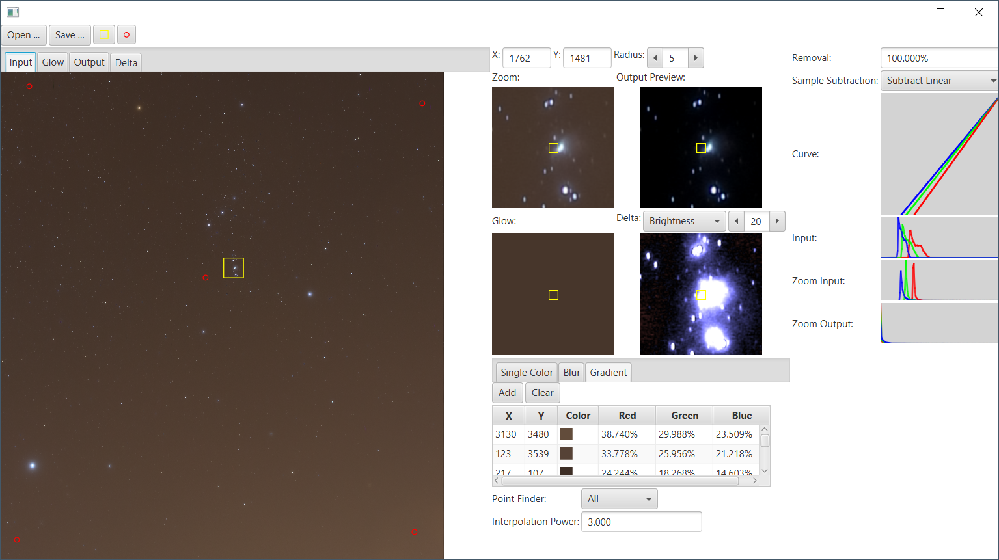

# ez-astrophotography

EZ-Astrophotography helps astrophotographers to process the images.

The main feature is to remove the sky glow (light pollution) from the
image.

It achieves this by calculating the sky glow and subtracting this from
the original image.

